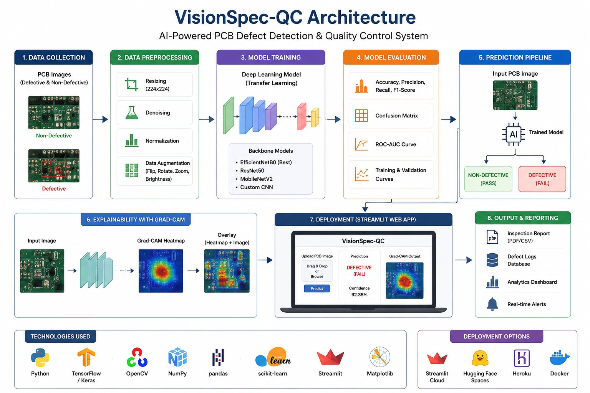

# VisionSpec-QC

An AI-based computer vision system for automated PCB quality inspection


# Overview

VisionSpec-QC is a computer vision-based industrial quality inspection system designed to automatically identify defective and non-defective products using deep learning techniques.

The project integrates CNN-based image classification with Grad-CAM visualization to improve transparency and explainability in automated inspection workflows.

This system helps industries reduce manual inspection efforts, improve accuracy, and enhance production quality using AI-powered visual analysis.

---

# Features

- Automated defect detection
- CNN-based image classification
- Grad-CAM explainability visualization
- Industrial quality inspection workflow
- Deep learning powered prediction system
- Real-time image testing support
- Streamlit-based interactive interface

---

# System Architecture



---
# Workflow

```text
Input Image
      ↓
Image Preprocessing
      ↓
CNN / Deep Learning Model
      ↓
Feature Extraction
      ↓
Defect Classification
      ↓
Grad-CAM Heatmap Generation
      ↓
Final Quality Inspection Result
```


## Project Structure
- dataset/ → images and data
- notebooks/ → model training
- models/ → saved models
- app/ → application code

## Team
- Ansha (Team Lead)
- Ayush (Setup & Development)
- Indu (Dataset)

# Tech Stack

- Python
- TensorFlow
- Keras
- OpenCV
- NumPy
- Pandas
- Matplotlib
- Streamlit
- Grad-CAM

# Applications

- Manufacturing industries
- Industrial quality assurance
- Automated inspection systems
- Smart factory environments
- Defect detection pipelines

